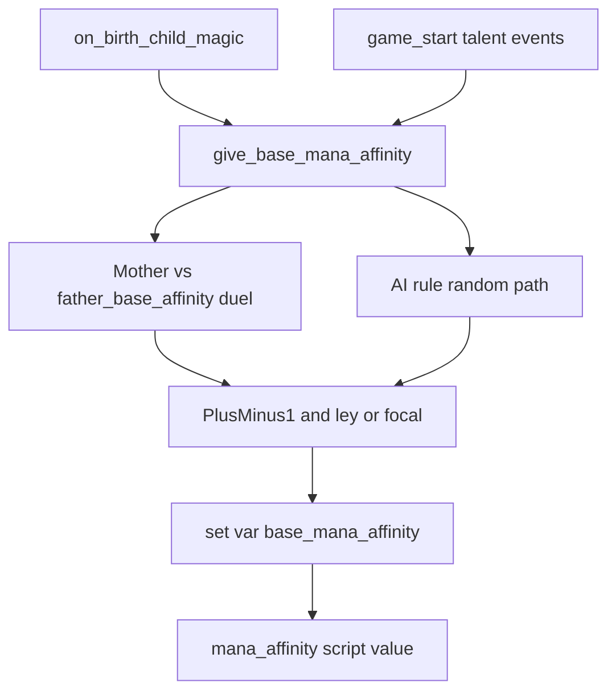

# Mana Affinity Documentation - Plan

## Goal

Deliver developer documentation for **Mana Affinity**: how the score is composed, how it is assigned at birth/game start, how parental (especially maternal) practice weights inheritance today, and a **Design** contract for unimplemented pregnancy/gestational influence. Match the shape and quality bar of [`docs/mechanics/mana-system.md`](docs/mechanics/mana-system.md).

**Product authority:** This work owns the Mana Affinity mechanics page and its requirements plan. Spell catalogs, core mana pool, and interaction-event catalogs are linked surrounding work.

**Carrying forward:** As-implemented + Design contract (option 2) over as-implemented-only or pregnancy-first — document code truth and settle intended gestational behavior for a later implementation plan.

## Scope

### In scope

1. **Requirements-only unified plan** at `docs/plans/2026-08-25-002-docs-mana-affinity-plan.md` (`artifact_readiness: requirements-only`, `product_contract_source: ce-brainstorm`) capturing Product Contract for the docs deliverable and the gestational Design contract.
2. **Primary mechanics page** [`docs/mechanics/mana-affinity.md`](docs/mechanics/mana-affinity.md) (new), status `draft`, following [`docs/mechanics/_template.md`](docs/mechanics/_template.md) / mana-system pattern:
   - Design: player meaning, tier bands, inheritance intent, **gestational Design contract** (settled requirements, marked unimplemented).
   - Implementation: variables, script values, birth/game-start call graph, formulas with code pointers.
   - Known gaps: pregnancy not implemented; high-severity script bugs called out as verification notes (not fixed in this pass).
3. **Cross-links:** Update Related links from [`docs/mechanics/mana-system.md`](docs/mechanics/mana-system.md), [`docs/mechanics/traits-secrets-and-potential.md`](docs/mechanics/traits-secrets-and-potential.md), [`docs/event-chains/mana-affinity-interactions.md`](docs/event-chains/mana-affinity-interactions.md), [`docs/event-chains/game-start-setup.md`](docs/event-chains/game-start-setup.md), and [`docs/mechanics/README.md`](docs/mechanics/README.md). Point affinity ownership at the new mechanics page; leave interaction stub as interaction-only.
4. **CONTEXT.md:** Only refine **Mana Affinity** wording if dialogue settles sharper player-facing language; no file paths in glossary.

### Out of scope

- Filling the full interaction event ID table in `mana-affinity-interactions.md` (stub stays; link to mechanics).
- Gameplay bugfixes (`father` vs `real_father`, dead dynasty birth scopes, legacy 4/5 mismatch) — document under Known gaps only.
- Implementing pregnancy/gestational systems.
- Expanding Magical Bloodline / dynasty-legacy feature pages beyond link + brief dependency notes.

## As-implemented surface (document as code truth)

Primary sources:

- [`common/script_values/00_ancient_magic_mana_affinity_values.txt`](common/script_values/00_ancient_magic_mana_affinity_values.txt) — tiers, `mana_affinity` composite, `mother_base_affinity` / `father_base_affinity`, bloodline boosts, blood compatibility.
- [`common/scripted_effects/00_ancient_magic_mana_affinity_effects.txt`](common/scripted_effects/00_ancient_magic_mana_affinity_effects.txt) — `give_base_mana_affinity`, game-start variant, `change_base_mana_affinity`.
- [`common/on_action/01_ancient_magic_child_birth_on_actions.txt`](common/on_action/01_ancient_magic_child_birth_on_actions.txt) — birth hook.
- [`events/ancient_magic_gain_talent_events.txt`](events/ancient_magic_gain_talent_events.txt) — game-start assignment + AI child overwrite.

Documented behavior outline:

- Composite: `base_mana_affinity` + optional Magical Bloodline boost + infused-blood var; capped.
- Parental scores use total parent `mana_affinity` and, if magus, mage-level adjustment (stronger maternal weight than paternal in the non-practicing penalty path).
- Downstream: Magic Potential / mana gen and max via `mage_potency` (link mana-system; do not re-own pool docs).

## Gestational Design contract (to settle in plan + mechanics Design)

Intent already stated: carrying mother’s accessible mana can boost (or otherwise affect) the unborn child; further maternal actions remain WIP.

**Still needed before writing the Product Contract body (one more dialogue beat):** primary gestational mechanism — passive ambient exposure from mother’s mana access vs active maternal actions vs both with a clear default. Plan execution will embed whatever is confirmed; until confirmed, do not invent ritual catalogs.

Design contract minimum once answered:

- When influence applies (during pregnancy vs only at birth settlement).
- What “mana the body has access to” means for the contract (pool, affinity, generation, or a named proxy).
- Allowed outcomes for v1 Design (affinity boost only vs boost + harm/other actions).
- Explicit non-goals (e.g. no affinity on unborn character entity until birth if that stays true).

## Code-review findings to surface in Known gaps (no fixes)

1. Inheritance gate uses `real_father`; scored value uses legal `father`.
2. `base_mana_affinity_bonus` likely dead on birth path (`scope:mother` / `scope:real_father` never saved).
3. Dynasty legacy 4/5 loc vs code mismatch; legacy 5 birth effect missing.
4. Dead parents can open inheritance then contribute 0; player children skip AI inheritance overwrite at game start.

## Delivery sequence

1. Finish one gestational-mechanism question; fold answer into Product Contract.
2. Write requirements-only plan under `docs/plans/`.
3. Author `docs/mechanics/mana-affinity.md` from that contract + verified code.
4. Wire Related/README links; optionally thin-update CONTEXT if wording sharpened.
5. Do not change gameplay scripts in this pass.

## Success criteria

- A contributor can explain affinity tiers, composite score, birth inheritance (including maternal practice weighting), and game-start paths without reading every script.
- Gestational influence is documented as **Design intent / unimplemented**, with enough settled rules that a later `ce-plan` implementation pass does not invent primary behavior.
- High-severity script bugs are listed as Known gaps with file pointers.
- Mana-system and affinity ownership stay split via links.
