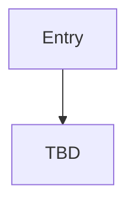

# {Event Chain Title}

> Stub — copy from this template when authoring event-chain docs.

## Vanilla override

<!-- Delete this section if not applicable. If overriding vanilla, keep and fill: -->

> **Vanilla override:** This chain modifies vanilla namespace `{namespace}` in `{file}`. See [education-and-childhood.md](education-and-childhood.md) for the reference callout pattern.

## Entry points

| Trigger | Location |
|---------|----------|
| TBD | `events/...` or `common/on_action/...` |

## Flow

## Event ID table

| Event ID | Purpose | Loc keys |
|----------|---------|----------|
| `{namespace}.{id}` | TBD | TBD |

## Known gaps

- TBD

## Related docs

- TBD
