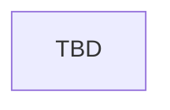

# Education and Childhood

> **Reference exemplar** for documenting vanilla overrides in event-chain docs.

## Vanilla override

> **Vanilla override:** This chain modifies the vanilla `childhood_education` namespace in `events/education_and_childhood/childhood_education_events.txt`. Ancient Magic adds parallel files under `events/education_and_childhood/` (`AM_education_and_talents`, coming-of-age hooks) and education scripted effects. When documenting other overrides, copy this callout block and link the vanilla namespace and mod file paths.

| Vanilla | Mod |
|---------|-----|
| `childhood_education` events | `events/education_and_childhood/childhood_education_events.txt` |
| — | `events/education_and_childhood/ancient_magic_education_and_talents.txt` (`AM_education_and_talents`) |
| — | `events/education_and_childhood/ancient_magic_coming_of_age_events.txt` |

## Entry points

| Trigger | Location |
|---------|----------|
| Childhood on_actions | `common/on_action/01_ancient_magic_childhood_on_actions.txt` |
| Education effects | `common/scripted_effects/01_ancient_magic_education_effects.txt` |

## Flow

## Event ID table

| Event ID | Purpose | Loc keys |
|----------|---------|----------|
| `childhood_education.*` | Vanilla education flow (overridden file) | TBD |
| `AM_education_and_talents.002` | Arcane education → mana affinity | TBD |
| TBD | Coming of age | TBD |

## Known gaps

- Map full vanilla event ID diff TBD

## Related docs

- [mechanics/traits-secrets-and-potential.md](../mechanics/traits-secrets-and-potential.md)
- [event-chains/game-start-setup.md](game-start-setup.md)
