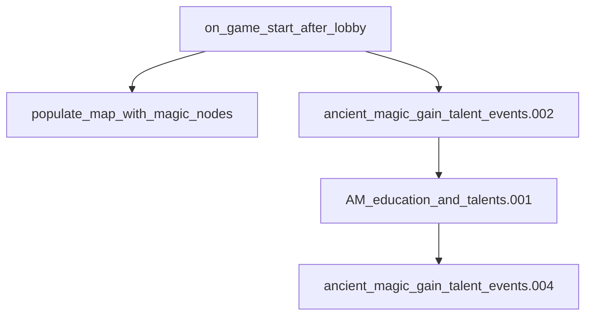

# Game Start Setup

> Stub — **primary** doc for post-lobby initialization (ley lines, mana affinity, education boosts).

## Entry points

| Trigger | Location |
|---------|----------|
| After lobby | `common/on_action/01_ancient_magic_game_start_actions.txt` (`on_game_start_after_lobby`) |
| Base game start | `common/on_action/magic_on_actions.txt` (`on_game_start`) |
| Talent events | `events/ancient_magic_gain_talent_events.txt` |

## Flow

## Event / hook table

| ID / hook | Purpose |
|-----------|---------|
| `populate_map_with_magic_nodes` | Ley line map population |
| `ancient_magic_gain_talent_events.002` | Gives everyone base mana affinity |
| `AM_education_and_talents.001` | Boosts affinity for arcane education |
| `ancient_magic_gain_talent_events.004` | Corrects child AI affinity vs parents |

## Known gaps

- Full ordering and delays TBD in detail pass

## Related docs

- [mechanics/traits-secrets-and-potential.md](../mechanics/traits-secrets-and-potential.md)
- [features/ley-lines-and-mapmode.md](../features/ley-lines-and-mapmode.md)
- [event-chains/education-and-childhood.md](education-and-childhood.md)
