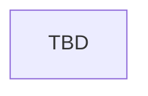

# Health and Healing

> Stub — `AMHealth` player healing plus AI spellbook restoration events `.301`–`.303`.

## Entry points

| Trigger | Location |
|---------|----------|
| Health events | `events/ancient_magic_health_events.txt` (`AMHealth`) |
| AI healing | `events/ancient_magic_ai_spellbook_events.txt` |
| Health pulse | `common/on_action/01_ancient_magic_health_on_actions.txt` |

## Flow

## Event ID table

| Event ID | Purpose | Notes |
|----------|---------|-------|
| `AMHealth.*` | Player-facing magical health | TBD — catalog in implementation pass |
| `ancient_magic_ai_spellbook_events.301` | Minor Restoration (AI) | Decision-intertwined — do not delete |
| `ancient_magic_ai_spellbook_events.302` | Major Restoration (AI) | Decision-intertwined |
| `ancient_magic_ai_spellbook_events.303` | Full Restoration (AI) | Decision-intertwined |

## Known gaps

- **Missing back-menu event:** `ancient_magic_ai_spellbook_events.001` is not present in code (expected back-menu for AI spellbook flow).

## Related docs

- [schools/chiromancy.md](../schools/chiromancy.md)
- [mechanics/mana-system.md](../mechanics/mana-system.md)
