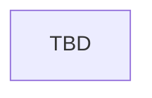

# Mana Affinity Interactions

> Stub — character interactions that read or modify mana affinity.

## Entry points

| Trigger | Location |
|---------|----------|
| Interaction events | `events/interaction_events/ancient_magic_mana_affinity_interaction_events.txt` |
| Affinity effects | `common/scripted_effects/00_ancient_magic_mana_affinity_effects.txt` |

## Flow

## Event ID table

| Event ID | Purpose | Loc keys |
|----------|---------|----------|
| TBD | TBD | TBD |

## Known gaps

- Catalog interaction event IDs TBD

## Related docs

- [mechanics/traits-secrets-and-potential.md](../mechanics/traits-secrets-and-potential.md)
- [CONTEXT.md](../../CONTEXT.md) — **Mana Affinity**
