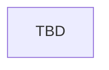

# Rituals and Blood

> Stub — ritual spells, bloodline forging, and related decision flows.

## Entry points

| Trigger | Location |
|---------|----------|
| Ritual events | `events/ancient_magic_rituals_events.txt` (`ancient_magic_rituals_events`) |
| Decisions | `common/decisions/01_magic_decisions.txt` |

## Flow

## Event ID table

| Event ID | Purpose | Loc keys |
|----------|---------|----------|
| `ancient_magic_rituals_events.001` | Forge soul (example) | `ancient_magic_rituals_events.001.*` |
| TBD | TBD | TBD |

## Known gaps

- Full ritual catalog TBD

## Related docs

- [schools/necromancy.md](../schools/necromancy.md)
- [features/artifacts-and-ingredients.md](../features/artifacts-and-ingredients.md)
- [CONTEXT.md](../../CONTEXT.md) — **Mage Ritual**, **Magical Bloodline**
