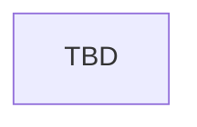

# Secrets and Exposure

> Stub — magic secret discovery, exposure, and consequences.

## Entry points

| Trigger | Location |
|---------|----------|
| Secret events | `events/ancient_magic_secret_events.txt` (`magic_secrets`) |
| Secret types | `common/secret_types/00_magic_secrets.txt` |

## Flow

## Event ID table

| Event ID | Purpose | Loc keys |
|----------|---------|----------|
| `magic_secrets.*` | TBD | TBD |

## Known gaps

- Full exposure graph TBD

## Related docs

- [mechanics/traits-secrets-and-potential.md](../mechanics/traits-secrets-and-potential.md)
