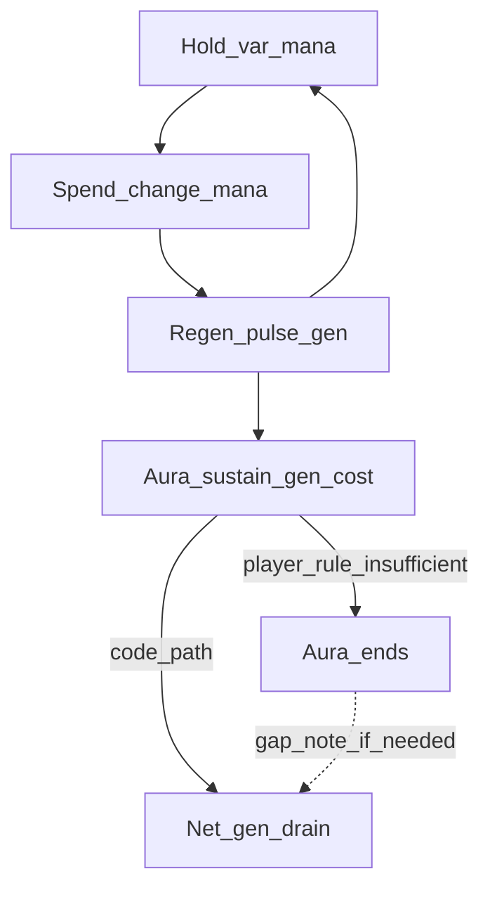

# Mana System Documentation - Plan

## Goal Capsule

- **Objective:** Fill `docs/mechanics/mana-system.md` for the **core mana pool** (hold, spend, regen, aura sustain) from live code and loc—including Variables and Contributors—and ship a companion Cursor canvas lifecycle map.
- **Product authority:** This plan owns core mana documentation only. Mana Affinity, spell catalogs, and magic-window UI are surrounding work, not active scope.
- **Open blockers:** None.

## Product Contract

### Summary

Replace the mana-system stub with a lifecycle-structured mechanics page (Design + Implementation + Variables + Contributors) grounded in code and game concepts, plus an IDE canvas that mirrors the same lifecycle for side-by-side reading.

Product Contract preservation: restructured, no scope change: R6/AE2 clarified for player-facing aura-ends plus explicit code-gap note (session-settled planning fidelity).

### Problem Frame

The stub lists entry points but does not explain pool composition, pulse timing, or aura drain. Maintainers and designers currently reverse-engineer scripts and loc separately. The docs scaffold already ranks mana first in the core-loop fill order.

### Key Decisions

- **KD1. Core mana only.** Document the pool, gen/max composition, pulse, spend hooks, and aura sustain; link affinity and spellbook rather than absorb them. (session-settled: user-directed — chosen over affinity-inclusive or everything-mana-named: affinity already has its own stub and trail) Governs R1, R8.
- **KD2. Dual audience via template sections.** Short Design for player rules; Implementation for maintain/debug. (session-settled: user-directed — chosen over design-only or debug-only: matches mechanics template) Governs R2, R3.
- **KD3. Worked formulas, not a modifier catalog.** Show how gen/max compose and how the pulse runs; include constants only when they define the system. (session-settled: user-directed — chosen over category map or full catalog: enough to debug composition without listing every perk) Governs R4.
- **KD4. Lifecycle narrative + Variables table.** Walk hold → spend → regen → aura sustain in Design and Implementation; add a thin Variables table for debug symbols/buckets. (session-settled: user-directed — chosen over file-anchored or claim-trace alone, and over A without Variables: both readers + low-cost debug surface) Governs R2, R3, R5.
- **KD5. Spend + aura sustain in-doc.** Cover `change_mana` and monthly drain / `_gen_cost` sustain-and-fail behavior; leave per-spell numbers to linked docs. (session-settled: user-directed — chosen over hooks-only or example spells: drain is part of the core loop) Governs R6, R7.
- **KD6. One Contributors list from git nicknames.** Unique nicks across cited code paths, refreshed from `git log` at write time. (session-settled: user-directed — chosen over per-row or both: single attribution surface) Governs R9.
- **KD7. Companion canvas in Cursor canvases.** Lifecycle map as `.canvas.tsx` beside chat, not under `docs/`. (session-settled: user-approved — confirmed with synthesis default over mermaid-in-docs as primary) Governs R10.

### How This Work Fits Together

<!-- ce-section: work-relationships -->

This plan owns **core mana pool documentation**. Broader understanding (not a committed roadmap):

- **Mana Affinity docs** (`docs/event-chains/mana-affinity-interactions.md` and related)
  - **Shares** `mana_affinity` as an input to gen/max formulas
  - **Can proceed independently of** this plan’s page body
- **Spellbook and auras** (`docs/mechanics/spellbook-and-auras.md`, spell-index)
  - **Depends on** this plan for accurate mana spend/drain vocabulary
  - **Enables** per-spell cost detail this plan deliberately omits
- **Advancement / magic windows**
  - **Can proceed independently of** this plan (no mana UI in those windows today)

### Requirements

**Document shape**

- R1. The deliverable updates `docs/mechanics/mana-system.md` for the core mana pool only, leaving Mana Affinity and per-spell catalogs to linked docs.
- R2. The page keeps audience `dev-design` and includes `## Design` (player rules from CONTEXT / game concepts) and `## Implementation` (lifecycle walk with code entry points).
- R3. Design and Implementation follow the same lifecycle order: hold pool → spend on cast → regen pulse → aura sustain / fail.
- R5. The page includes a thin **Variables** table covering at least `var:mana`, max-mana source, and gen income/expense buckets used by the HUD tooltip.
- R9. The page includes one **Contributors** list of unique git nicknames from history on cited code paths (and closely coupled files the page cites), gathered at write time—not guessed.

**Content fidelity**

- R4. Implementation shows worked composition for net mana gen and max mana, plus monthly vs optional-daily pulse timing, without enumerating every perk/legacy constant.
- R6. Design states the player-facing rule that insufficient sustain ends the aura (game concepts). Implementation documents spend via shared mana-change effects and aura start/pay paths, explains monthly drain / `_gen_cost` sustain into net gen, and explicitly notes any code gap if auto-end (`stop_aura` / `kill_aura`) is not wired on sustain failure.
- R7. The page calls out that `_gen_cost` is a misnomer (positive values increase gen) where drain naming appears.
- R8. Related docs link at least spellbook-and-auras, advancement, mana-affinity (or affinity event-chain), and spell-index / systems HUD as appropriate; vocabulary matches CONTEXT.md (Mana, Magic Potential, Mage Level, Aura; avoid Magic Power as the concept name).

**Companion canvas**

- R10. A Cursor canvas lifecycle map mirrors the doc’s hold → spend → regen → aura-sustain loop for side-by-side reading (IDE canvases path, not under `docs/`).

### Acceptance Examples

- AE1. Covers R4, R3.
  - **Given:** A reader opens Implementation.
  - **When:** They trace net gen and max mana.
  - **Then:** They see how income and drain buckets compose and how the pulse applies `change_mana`, without a full perk constant dump.
- AE2. Covers R6, R7.
  - **Given:** An aura with monthly sustain is active.
  - **When:** The doc explains sustain failure.
  - **Then:** Design (or Design-linked prose) states that insufficient mana/gen ends the aura; Implementation notes the `_gen_cost` naming pitfall and any missing auto-end wiring vs that player rule.
- AE3. Covers R9.
  - **Given:** Contributors are listed.
  - **When:** Compared to `git log` on cited paths.
  - **Then:** Nicknames match unique authors from that history (e.g. paths under the page’s `code_roots` plus cited coupled files).
- AE4. Covers R10, R3.
  - **Given:** The canvas is open beside the markdown.
  - **When:** A reader follows the lifecycle.
  - **Then:** Canvas stages match the doc’s hold → spend → regen → aura-sustain order.

### Success Criteria

- A designer can check pool / regen / cost / drain rules against CONTEXT/loc without opening scripts.
- A maintainer can locate the right file and formula for a HUD or gen bug from Implementation + Variables alone.
- Doc `status` is `draft` once substantive content lands (per KTD1).

### Scope Boundaries

**In scope**

- Core pool, gen/max composition, pulse, spend hooks, aura sustain/fail, HUD as the mana UI surface, Contributors, companion canvas.

**Deferred for later**

- Optional mermaid duplicate inside the markdown (canvas is primary visual).
- Filling Mana Affinity and spellbook stubs.

**Out of scope**

- Full modifier/perk constant catalog.
- Per-spell cast cost examples.
- Documenting mana UI in `window_magic.gui` / `window_magic_advancement.gui` (none present).
- Per-file author rows.
- Changing gameplay scripts (documentation only).

### Dependencies / Assumptions

- Source-of-truth order remains Code > Localization game concepts > in-repo docs (`docs/README.md`), with the session exception that Design carries the player-facing aura-ends rule and Implementation must surface a code gap rather than silently drop the loc rule (per KTD3).
- `mana_affinity` appears only as a formula input; affinity behavior stays in its own docs.
- Game rule `am_magic_gen_daily` selects daily vs monthly pulse (verified in on_actions).
- Claim check (2026-08-25): stub status, HUD-only mana UI, gen/max/pulse/`_gen_cost` note, CONTEXT vocabulary, and Design/Implementation template shape all confirmed against the repo.

### Outstanding Questions

**Resolved in Planning**

- Frontmatter expansion: expand `code_roots` / `loc_roots` to coupled citation targets (KTD2 / U1).
- Canvas: `mana-system-lifecycle.canvas.tsx` with `cursor/canvas` components (KTD4 / U4).
- Status after fill: `draft` (KTD1); repo has no `active` status.

**Deferred to Implementation**

- Exact prose for the code-gap callout after re-verifying whether any pulse/aura path auto-stops auras on insufficient gen at write time.
- Final Contributors nickname list (must come from live `git log`).

### Sources / Research

- Stub and peers: `docs/mechanics/mana-system.md`, `docs/mechanics/_template.md`, `docs/features/_template.md`, `docs/README.md` (status lifecycle, SoT order).
- Code: `common/script_values/01_ancient_magic_mana_system_values.txt`, `common/on_action/01_ancient_magic_mana_system_on_actions.txt`, `common/scripted_effects/01_ancient_magic_effects.txt`, `common/scripted_effects/01_ancient_magic_spell_system_effects.txt`, `gui/custom_gui/mana_system_hud.gui`.
- Coupled citation candidates: `common/script_values/01_ancient_magic_spell_cost_values.txt`, `common/scripted_guis/01_ancient_magic_hud_sguis.txt`, `common/scripted_triggers/01_ancient_magic_spell_triggers.txt`, `common/game_rules/01_ancient_magic_game_rules.txt`.
- Loc / glossary: `localization/english/ancient_magic_game_concepts_l_english.yml`, `localization/english/magic_gui_l_english.yml`, `localization/english/ancient_magic_l_english.yml`, `CONTEXT.md`.
- Canvas skill / SDK: IDE canvases directory + `cursor/canvas` (no in-repo canvas precedents).

---

## Planning Contract

### Key Technical Decisions

- KTD1. Set page `status: draft` when substantive Design/Implementation content lands. (session-settled: user-approved via plan confirmation — chosen over `active` / jump to `review`: matches `docs/README.md` lifecycle; `active` is not a valid status)
- KTD2. Expand frontmatter `code_roots` / `loc_roots` to coupled spend, HUD, and drain-wiring files the page cites; keep affinity and spell catalogs out of roots. (session-settled: user-approved via synthesis default — chosen over stub-minimal frontmatter)
- KTD3. Design states the player-facing rule that auras end when sustain fails; Implementation documents drain into net gen / cast gates and explicitly notes any missing auto-end wiring. (session-settled: user-directed — chosen over Code-only / loc-as-aspirational-only) Governs R6, AE2.
- KTD4. Companion canvas filename `mana-system-lifecycle.canvas.tsx` in the IDE canvases path; import only from `cursor/canvas`; use Stack + stage labels (Pill/cards), Callout for `_gen_cost`, thin symbol Table; optional DAG for the loop.
- KTD5. Verify with content/fidelity checks (path existence, symbol greps, Contributors from git log, canvas stage-order match)—not unit tests or gameplay edits. Execution note for all units: prefer smoke/content verification over unit coverage.

### Assumptions

- Planning-time research found no clear pulse-driven auto-`stop_aura`/`kill_aura` on insufficient gen; implementers re-verify before finalizing the gap note (deferred implementation detail above).
- English-only `loc_roots` match every current stub.
- Canvas lives outside the git mod tree (IDE-managed canvases dir); the plan still treats it as a required deliverable for R10/AE4.

### High-Level Technical Design

Page section order: Frontmatter → title → Design (lifecycle) → Implementation (lifecycle + formulas + entry table) → Variables → Contributors → Related docs. Omit unused template sections (Player experience / Balance) unless content exists.

---

## Implementation Units

### U1. Expand frontmatter and Related docs skeleton

**Goal:** Make the stub’s citation surface and Related docs match what the filled page will claim.

**Requirements:** R1, R8; KTD2

**Dependencies:** None

**Files:**

- Modify: `docs/mechanics/mana-system.md`

**Approach:**

1. Expand `code_roots` to keep stub entries and add at least: `common/scripted_effects/01_ancient_magic_effects.txt`, `common/script_values/01_ancient_magic_spell_cost_values.txt` (drain wiring only—not a spell catalog dump), `common/scripted_guis/01_ancient_magic_hud_sguis.txt`, `common/scripted_triggers/01_ancient_magic_spell_triggers.txt`; include `common/game_rules/01_ancient_magic_game_rules.txt` if the body names the pulse rule.
2. Expand `loc_roots` with HUD/GUI and breakdown label files (e.g. `magic_gui_l_english.yml`, `ancient_magic_l_english.yml`) while keeping game concepts; English only.
3. Update Related docs to link spellbook-and-auras, advancement, mana-affinity event-chain, spell-index, and gui-and-hud (doc-relative links).
4. Leave `status: stub` until U2 lands substantive content (U2 owns KTD1 / `draft`).

**Patterns to follow:** Peer stubs’ frontmatter shape; `docs/README.md` path and link conventions.

**Test scenarios:**

- Happy path: Every path listed in `code_roots` and `loc_roots` exists on disk.
- Edge case: Affinity values / spellbook on_actions are linked from Related or mentioned as formula inputs only—not added as absorbing scope in roots.
- Integration: Related doc targets resolve (files exist).

**Verification:** Frontmatter paths and Related links are valid; roots do not pull affinity/spellbook ownership into this page.

### U2. Fill Design + Implementation lifecycle

**Goal:** Replace TBD Design and thin Implementation table with lifecycle-ordered, fidelity-checked content.

**Requirements:** R2, R3, R4, R6, R7, R8; AE1, AE2; KTD1, KTD3, KTD5

**Dependencies:** U1

**Files:**

- Modify: `docs/mechanics/mana-system.md`
- Reference (read-only): `common/script_values/01_ancient_magic_mana_system_values.txt`, `common/on_action/01_ancient_magic_mana_system_on_actions.txt`, `common/scripted_effects/01_ancient_magic_effects.txt`, `common/scripted_effects/01_ancient_magic_spell_system_effects.txt`, `localization/english/ancient_magic_game_concepts_l_english.yml`, `CONTEXT.md`

**Approach:**

1. Design: player rules for hold → spend → regen → aura sustain/fail using CONTEXT / game concepts; state that insufficient sustain ends the aura.
2. Implementation: same order with entry points; worked composition for `ancient_magic_mana_gen` / max mana; monthly vs daily pulse via `am_magic_gen_daily`; spend via `change_mana`; aura start/pay; `_gen_cost` misnomer (perk positive vs spell drain negative as applicable).
3. Explicit code-gap note if re-verification finds no auto-end on sustain failure (KTD3).
4. Set `status: draft`. Vocabulary: Mana, Magic Potential, Mage Level, Aura—avoid Magic Power.

**Execution note:** Re-verify aura auto-end against live scripts before locking the gap sentence; do not invent script names.

**Patterns to follow:** `docs/features/_template.md` Design/Implementation split; SoT order with KTD3 exception for player-rule + gap note.

**Test scenarios:**

- Happy path (Covers AE1.): Reader can trace net gen, max mana, and pulse → `change_mana` without a perk constant dump.
- Happy path (Covers AE2.): Design states aura ends on insufficient sustain; Implementation notes `_gen_cost` pitfall and any auto-end gap.
- Edge case: Magic Potential / Mana Affinity / HUD potency labeling are distinguished, not collapsed.
- Error/failure path: Gap note only appears when auto-end is absent; if wiring is found at write time, document the real stop path instead of claiming a gap.
- Integration: Named effects/values/on_actions exist in cited files (`rg` / open-file check).

**Verification:** Design and Implementation share lifecycle order; AE1/AE2 satisfied; status is `draft`; no gameplay files modified.

### U3. Variables table + Contributors

**Goal:** Add thin debug symbol table and one git-derived Contributors list.

**Requirements:** R5, R9; AE3; KTD5

**Dependencies:** U2 (so cited paths are known)

**Files:**

- Modify: `docs/mechanics/mana-system.md`

**Approach:**

1. Add `## Variables` (thin Symbol | Role) covering at least `var:mana`, max-mana source (`ancient_magic_max_mana` or equivalent), and HUD gen income/expense buckets.
2. Add one `## Contributors` list: unique nicknames from `git log --format='%an'` on the page’s `code_roots` (and closely coupled cited files) at write time—not guessed.
3. Place Variables then Contributors before Related docs.

**Patterns to follow:** Features template Variables shape; KD6 single list (no per-file rows).

**Test scenarios:**

- Happy path: Variables table includes pool, max, and HUD income/expense symbols that appear in HUD/values code.
- Happy path (Covers AE3.): Contributors match unique authors from `git log` on cited paths.
- Edge case: Empty or single-author history still lists that author once (no fabricated names).

**Verification:** No invented symbols; Contributors not hand-waved; sections ordered Design → Implementation → Variables → Contributors → Related docs.

### U4. Companion canvas lifecycle map

**Goal:** Ship IDE canvas mirroring the doc lifecycle for side-by-side reading.

**Requirements:** R10; AE4; KTD4, KTD5

**Dependencies:** U2 (lifecycle order and terminology locked)

**Files:**

- Create: IDE canvases path `mana-system-lifecycle.canvas.tsx` (not under `docs/`; workspace canvases directory managed by Cursor)

**Approach:**

1. Default-export one component; import only from `cursor/canvas`.
2. Stages in hold → spend → regen → aura-sustain order; Callout for `_gen_cost`; thin symbol table optional; no empty/placeholder states.
3. Caption/source points at core mana code paths; do not absorb affinity/spell catalogs.

**Execution note:** This is packaging/visual deliverable; prefer IDE canvas typecheck/open smoke over unit tests.

**Patterns to follow:** Cursor canvas skill (kebab-case filename, no relative imports, theme tokens).

**Test scenarios:**

- Happy path (Covers AE4.): Canvas stages match doc lifecycle order.
- Edge case: No empty-state placeholders; sections without data are omitted.
- Integration: File opens as a Cursor canvas (correct directory + `.canvas.tsx` extension); TypeScript against `cursor/canvas` is clean.

**Verification:** Absolute path of the canvas can be linked in chat; R10/AE4 satisfied; no files under `docs/` pretending to be the canvas.

---

## Verification Contract

- Frontmatter: every `code_roots` / `loc_roots` path exists.
- Symbol fidelity: every named script value, effect, on_action, and variable in the page exists in cited files; unknowns marked `TBD` only if unavoidable.
- AE2 fidelity: player-facing aura-ends rule present; `_gen_cost` pitfall noted; code gap or real auto-end path documented after re-verify.
- Contributors: `git log --format='%an' -- <cited paths> | sort -u` matches the list.
- Cross-links: Related docs targets exist; vocabulary matches CONTEXT.md.
- Canvas: present under IDE canvases path; stage order matches doc; compiles under canvas rules.
- Scope: no gameplay script diffs; `descriptor.mod` untouched; page `status` is `draft`.

## Definition of Done

- U1–U4 complete with their verification outcomes met.
- Product requirements R1–R10 and acceptance examples AE1–AE4 satisfied.
- Mechanics page is `draft` with Design, Implementation, Variables, Contributors, and Related docs filled for core mana only.
- Companion canvas ships beside chat for the same lifecycle.
- No affinity/spellbook stub fills and no gameplay changes in the delivery.
