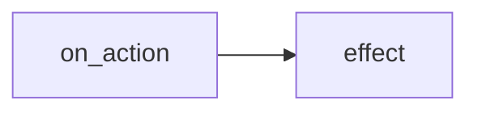

# {System Title}

> Stub — copy for `systems/` architecture docs.

## Overview

What this system does and which gameplay areas it connects.

TBD

## Components

| Component | Path | Role |
|-----------|------|------|
| TBD | `common/...` | TBD |

## Pulse / hook graph

How on_actions, yearly pulses, or GUI callbacks chain together.

TBD

## Key variables

| Variable / flag | Set by | Read by |
|-----------------|--------|---------|
| TBD | TBD | TBD |

## File index

| File | Contents |
|------|----------|
| TBD | TBD |

## Failure modes

- TBD — what breaks if misconfigured

## Related docs

- TBD
